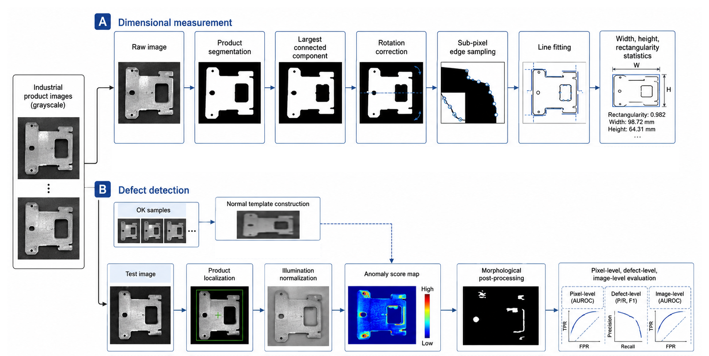
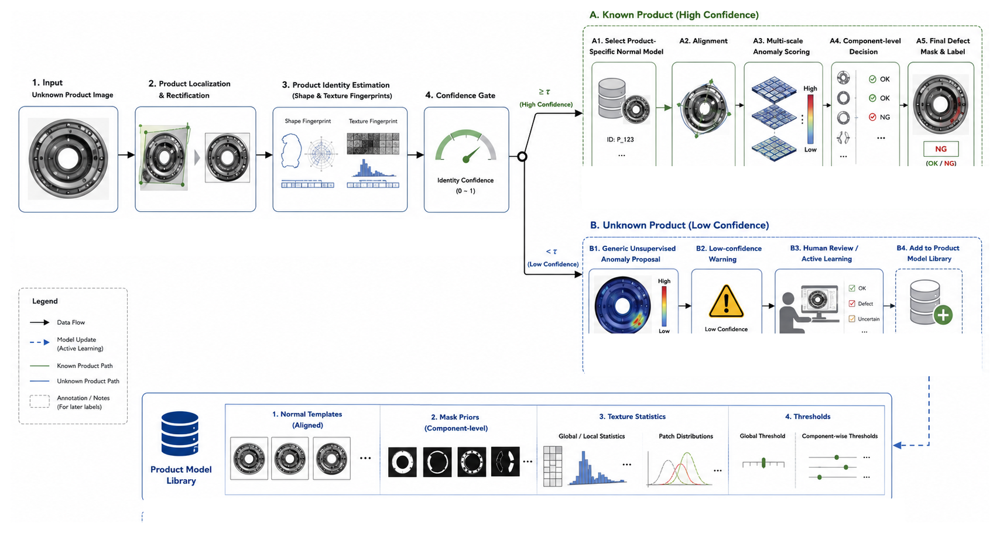
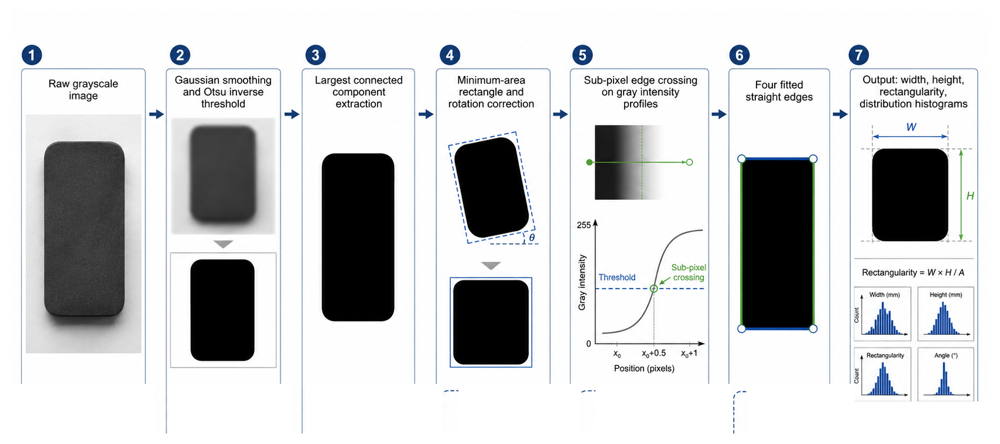
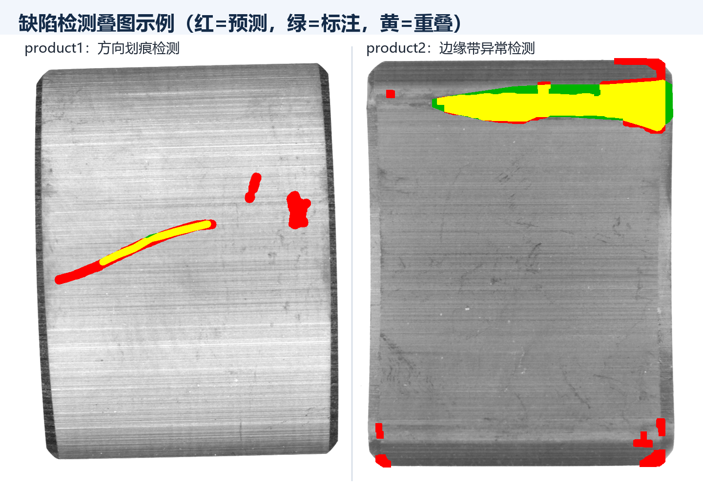

# 工业视觉测量与缺陷检测

[English](README.md) | [简体中文](README.zh-CN.md)

本项目实现了一套完整的传统机器视觉流水线，覆盖亚像素尺寸测量、面向不同产品的缺陷检测，以及带置信度控制的未知产品识别与检测策略分流。

> 深圳大学《机器视觉技术及工业应用》课程项目。公开仓库仅包含核心代码、评估结果和代表性图片，不包含原始工业图像数据。



## 项目亮点

- **亚像素尺寸测量**：结合 Otsu 分割、最大连通域筛选、姿态校正、灰度插值与直线拟合，估计产品宽度、高度、矩形度及边缘 RMS。
- **产品自适应缺陷检测**：针对划痕型异常和边缘带状异常分别设计可解释的传统视觉检测器。
- **未知产品自动分流**：从 OK 样本建立产品模型库，先判断产品类别与置信度，再自动调用相应检测策略；低置信度样本进入人工复核队列。
- **可审计实验输出**：自动生成 CSV/JSON 指标、缺陷叠加图、测量分布图和单张图片预测结果。

## 实验结果

| 评估任务 | 主要结果 |
|---|---:|
| Product 1 图像级检测 | 准确率 **96.70%**，F1 **96.39%** |
| Product 2 图像级检测 | 召回率 **91.11%**，F1 **73.21%** |
| 未知产品身份识别 | 总体准确率 **91.15%** |
| 基于置信度的自动处理 | 自动覆盖率 **91.67%** |
| 自动接收样本的产品识别 | 准确率 **99.43%** |
| 低置信度人工复核 | 占输入样本 **8.33%** |
| 未知产品端到端缺陷检测 | 召回率 **94.19%**，F1 **81.82%** |

实验表明，当前系统更擅长完成图像级缺陷筛查，而精确的像素级缺陷定位仍有提升空间。完整机器可读指标见 [`results/`](results/) 目录。



## 方法设计

### 1. 亚像素尺寸测量

首先对深色工件进行 Otsu 阈值分割并保留最大连通域；随后利用最小外接旋转矩形估计姿态，将产品长轴校正至水平方向。在四条边缘附近进行灰度阈值交点插值，分别拟合上下左右边缘，最终输出宽度、高度、边缘拟合 RMS 和矩形度。



### 2. 缺陷检测

- **Product 1**：主要面向划痕和局部纹理异常，融合 OK 模板差分、Top-hat、Black-hat、局部背景残差和非水平 Hough 直线证据。
- **Product 2**：主要面向靠近上下边缘的大块带状异常，在边缘候选区域内融合模板差分、行背景差分和局部亮度差分。

随后通过形态学操作、连通域面积和形状约束生成缺陷区域，并给出图像级 OK/NG 判定。



### 3. 未知产品识别与安全分流

系统从各类产品的 OK 样本中提取主体形状、纹理缩略特征和正常模板，形成产品模型库。新图像输入后，系统先完成产品身份匹配：高置信度样本自动进入对应检测器；低置信度样本进入通用异常候选分支，并标记为需要人工复核。

这一设计将“识别不确定性”显式纳入检测流程，避免在产品类别不可靠时强行给出自动判断。

## 运行方法

```bash
python -m venv .venv
.venv\Scripts\activate        # Windows
pip install -r requirements.txt
python src/industrial_inspection.py --data-root data --output outputs
```

检测单张未知产品图片：

```bash
python src/industrial_inspection.py \
  --data-root data \
  --output outputs \
  --predict-image path/to/query.bmp
```

数据目录格式见 [`data/README.md`](data/README.md)。课程数据集未公开，请仅使用自己获得授权的数据副本。

## 仓库结构

```text
.
├── src/industrial_inspection.py   # 完整实验代码与命令行入口
├── assets/                        # 代表性流程图和结果图
├── results/                       # 精简后的评估结果
├── data/README.md                 # 数据目录约定，不含原始数据
└── requirements.txt
```

## 局限与后续改进

- 当前阈值主要针对两类产品和现有采集环境进行标定，照明、相机或产品型号改变后需要重新校准。
- Product 2 虽具有较高筛查召回率，但像素掩膜较碎，误检连通域较多。
- 后续可加入光照归一化、组件级置信度校准和学习式异常检测分支，同时保留人工复核机制。

## 作者

王凯 · 深圳大学电子信息工程
